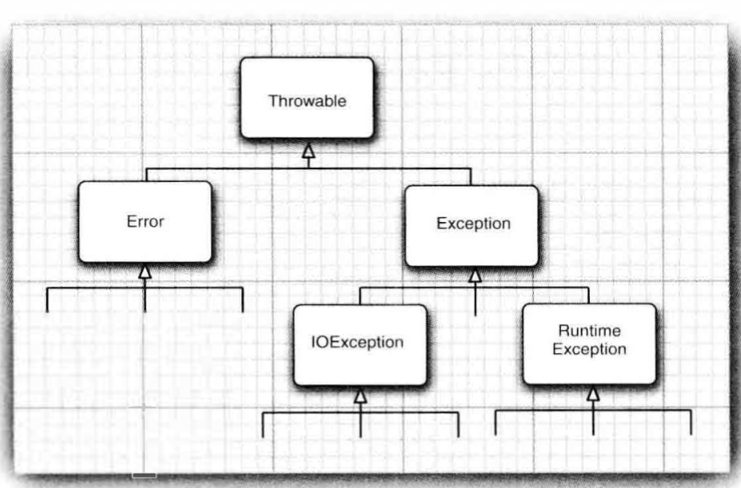
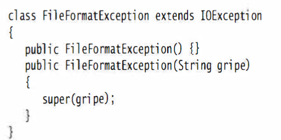

对于异常情况，需要做到以下几点：

- 向用户通报错误
- 保存所有的工作结果
- 允许用户以妥善的形式退出程序

# 异常分类

Java中异常对象都是继承了Throwable类的一个实例。如果内置的异常类不能够满足需求，用户可以自己创建异常类



Error类层次结构描述了Java运行时系统的内部错误和资源耗尽错误。 应用程序不应该
抛出这种类型的对象。 如果出现了这样的内部错误， 除了通告给用户， 并尽力使程序安全地
终止之外， 再也无能为力了。 这种情况很少出现

Exception类分为运行时异常RuntimeException，由程序错误导致的。另一种是由I/O错误等导致的其他异常

派生于RuntimeException的异常包括：

- 错误的类型转换
- 数组访问越界
- 访问null指针

不是派生于RuntimeException的异常包括

- 试图在文件尾部读取数据
- 试图打开一个不存在的文件
- 试图根据给定的字符串查找Class对象，而这个字符串表示的类是不存在的

“如果出现RuntimeException异常， 那 么就一定是你的问题” 是一条相当有道理的规则。

ava语言规范将派生于Error类或RuntimeException类的所 有 异 常 称 为非 受 查
(unchecked)异常， 所有其他的异常称为受查(checked)异常。

# 抛出异常

如果要抛出一个异常，例如EOFException，使用`throw new EOFException()`

然后在方法上抛出异常
```java
    String readData() throws EOFExcetion{
        ...
        throw new EOFExcetion();
        }
```

不需要抛出RuntimeException和继承Error的错误

# 创建异常类

创建自己的异常类的方法是：常见一个类，继承Exception类或者派生于Exception的子类。然后定义两个构造器方法，一个是默认的构造器方法，另一个是打印详细信息的构造器方法



# 捕获异常

如果某个异常发生的时候没有在任何地方进行捕获，那程序就会终止执行，并在控制台
上打印出异常信息，其中包括异常的类型和堆栈的内容

使用try/catch语句捕获异常

如果方法中的任何代码抛出了一个在 catch 子旬中没有声明的异常类型， 那么这个方法
就会立刻退出

在 catch 子旬中可以抛出一个异常， 这样做的目的是改变异常的类型C 如果开发了一个
供其他程序员使用的子系统

# finally子句

为了在try/catch中抛出异常后还可以对自己方法中的资源进行关闭等管理操作，Java提供了finally语句块

一般情况下finally中的语句都会执行


