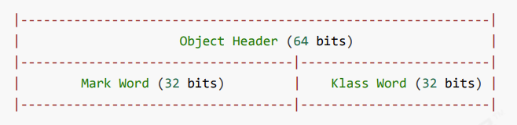
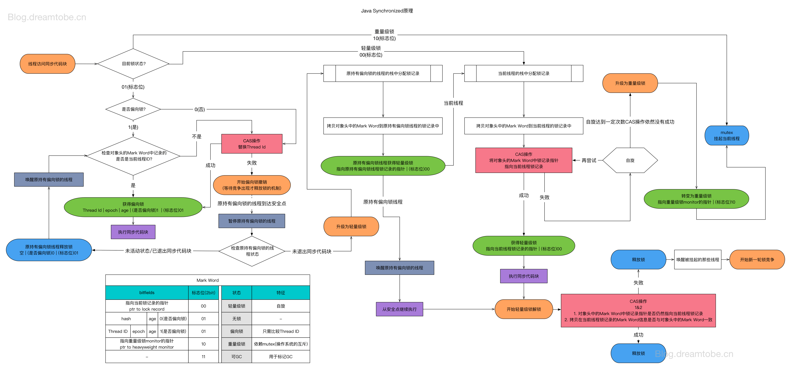
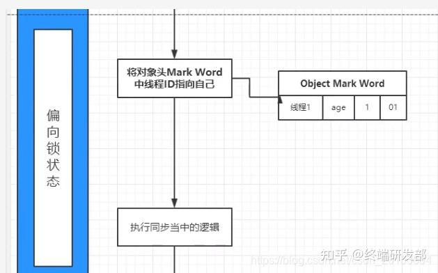

# synchronized介绍
即俗称的【对象锁】
它采用互斥的方式让同一时刻至多只有一个线程能持有【对象锁】，其它线程再想获取这个【对象锁】时就会阻塞住。这样就能保证拥有锁的线程可以安全的执行临界区内的代码，不用担心线程上下文切换
Java中的每一个对象都可以作为一个锁。具体有三种：
- 对于普通的同步方法，锁的是当前实例对象
- 对于静态同步方法，锁的是当前类的class对象
- 对于同步方法块，锁的是Synchronized括号里的对象
# 语法
```java
synchronized (object) {
        //临界区
    }
```
用在方法上
```java
class Test{
    public synchronized void test(){
        
    }
}
```
等价于
```java
class Test{
    public void test(){
        synchronized (this){
            
        }
    }
}
```
用在静态方法上
```java
class Test{
    public synchronized static void test() {
    }
}
```
等价于
```java
class Test{
 public static void test() {
 synchronized(Test.class) {
 
 }
 }
}

```

# 线程八锁
考察对synchronized锁住对象
## 情况一
```java
class Number{
 public synchronized void a() {
 log.debug("1");
 }
 public synchronized void b() {
 log.debug("2");
 }
}
public static void main(String[] args) {
    Number n1 = new Number();
    new Thread(()->{ n1.a(); }).start();
    new Thread(()->{ n1.b(); }).start();
}
```
这里a和b锁住的实例对象
所以main中两个线程抢的是一个锁

## 情况二
```java
class Number{
 public synchronized void a() {
 sleep(1);
 log.debug("1");
 }
 public synchronized void b() {
 log.debug("2");
 }
}
public static void main(String[] args) {
 Number n1 = new Number();
 new Thread(()->{ n1.a(); }).start();
 new Thread(()->{ n1.b(); }).start();
}

```
与情况一相同

## 情况三
```java
class Number{
 public synchronized void a() {
 sleep(1);
 log.debug("1");
 }
 public synchronized void b() {
 log.debug("2");
 }
 public void c() {
 log.debug("3");
 }
}
public static void main(String[] args) {
 Number n1 = new Number();
 new Thread(()->{ n1.a(); }).start();
 new Thread(()->{ n1.b(); }).start();
 new Thread(()->{ n1.c(); }).start();
}
```
a b和情况一相同
c无锁

## 情况四
```java
class Number{
 public synchronized void a() {
 sleep(1);
 log.debug("1");
 }
 public synchronized void b() {
 log.debug("2");
 }
}
public static void main(String[] args) {
 Number n1 = new Number();
 Number n2 = new Number();
 new Thread(()->{ n1.a(); }).start();
 new Thread(()->{ n2.b(); }).start();
}
```
两个线程各自单独一个实例对象锁

## 情况五
```java
class Number{
     public static synchronized void a() {
     sleep(1);
     log.debug("1");
     }
     public synchronized void b() {
     log.debug("2");
     }
}
    public static void main(String[] args) {
        Number n1 = new Number();
        new Thread(()->{ n1.a(); }).start();
        new Thread(()->{ n1.b(); }).start();
    }
```
线程1锁住的是类对象
线程2锁住的是实例对象
两个对象是独立的

## 情况六
```java
class Number{
 public static synchronized void a() {
 sleep(1);
 log.debug("1");
 }
 public static synchronized void b() {
 log.debug("2");
 }
}
public static void main(String[] args) {
 Number n1 = new Number();
 new Thread(()->{ n1.a(); }).start();
 new Thread(()->{ n1.b(); }).start();
}
```
两个线程使用的是同一个类对象的锁

## 情况七
```java
class Number{
 public static synchronized void a() {
 sleep(1);
 log.debug("1");
 }
 public synchronized void b() {
 log.debug("2");
 }
}
public static void main(String[] args) {
 Number n1 = new Number();
 Number n2 = new Number();
 new Thread(()->{ n1.a(); }).start();
 new Thread(()->{ n2.b(); }).start();
}
```
两个锁，注意与情况五作比较

## 情况八
```java
class Number{
 public static synchronized void a() {
 sleep(1);
 log.debug("1");
 }
 public static synchronized void b() {
 log.debug("2");
 }
}
public static void main(String[] args) {
 Number n1 = new Number();
 Number n2 = new Number();
 new Thread(()->{ n1.a(); }).start();
 new Thread(()->{ n2.b(); }).start();
}
```
两个线程用的同一个类对象的锁

# synchronized锁
synchronized是JVM内置锁，通过内部对象Monitor（监视器锁）来实现，基于进入与退出monitor对象来实现方法与代码块的同步，监视器锁的实现，最终依赖操作系统的Mutex lock（互斥锁）来实现

## Java对象的组成


对象整体分为对象头和对象体

synchronized用的锁是就是利用对象头来实现加锁

普通对象的对象头如下(class word就是元数据指针)：


数组对象的对象头多了数组长度：


### mark word
32位系统的markword如下：


## 锁的分类
Java SE 1.6为了减少获得锁和释放锁带来的性能消耗，引入了“偏向锁”和“轻量级锁”
所以锁的状态从低到高依次是：无锁状态、偏向锁状态、轻量级锁状态和重量级锁状态
锁可以升级但不能降级，这种锁升级却不能降级的策略，目的是为了提高获得锁和释放锁的效率

注意，升级并不一定是一级级升的，有可能跨级别，比如由无锁状态，直接升级为轻量级锁

- 无锁，不锁住资源，多个线程只有一个能修改资源成功，其他线程会重试；
- 偏向锁，同一个线程获取同步资源时，没有别人竞争时，去掉所有同步操作，相当于没锁；
- 轻量级锁，多个线程抢夺同步资源时，没有获得锁的线程使用CAS自旋等待锁的释放；
- 重量级锁，多个线程抢夺同步资源时，使用操作系统的互斥量进行同步，没有获得锁的线程阻塞等待唤醒



以如下代码为例子分析几种锁状态
```java
public class TestNotes{
    private static Object object;
    //减库存
    public String decStock(){
        synchronized (object){
            //todo
        }
        return "下单成功";
    }
}
```

### 无锁状态

#### 无锁状态到偏向锁
synchronized锁的object对象头部markword区域，最开始锁状态标志位，默认值就是001，也就是无锁状态


此时线程1执行到同步代码块，会首先检查状态位

如果不是01则表示不是无锁状态或者偏向锁

如果是01则表示是无锁状态或者偏向锁

然后检查对象头的Mark Word中的线程id是否是自己

如果是则表示是属于自己的偏向锁，则直接进入共享区，不需要再进行CAS操作

如果不是，则有两种情况，一个是不属于自己的偏向锁，一个是无锁状态，这里通过检查是否为偏向锁的标志来判断

如果是1，则表示是不属于自己的偏向锁，则使用CAS竞争锁，进入到偏向锁升级为轻量级锁的过程

如果是0，则表示是无锁状态，虚拟机会使用CAS尝试修改状态标志位，修改为偏向锁状态，并且把线程1的线程ID记录到markword区域的23bit位，进入偏向锁状态，如下图：





### 偏向锁升级位轻量级锁
偏向锁的特点是在无多个线程同时竞争，一个线程需要重复获取锁的时候，可以提高线程获取锁的效率

以后线程1在进入和退出同步块时不需要进行CAS操作来加锁和解锁，只需简单地测试一下对象头的Mark Word里是否存储着指向当前线程的偏向锁。 如果测试成功，表示线程已经获得了锁。

线程1在持有偏向锁期间，线程2来了，下图右侧部分是线程2执行过程：


使用CAS尝试修改线程id的过程中，jvm会检查线程1的状态

jvm会首先暂停线程1，然后检查持有偏向锁的线程1是否活着，如果线程1不处于活动状态或者已经退出需要锁的代码块，则将对象头设置成无锁状态，然后线程2CAS修改线程id成功，获取偏向锁

如果线程1还处于活动状态并且没有退出同步代码块，则将锁升级为轻量级锁，线程2CAS自旋来尝试获取锁

### 轻量级锁
进入轻量级锁状态后，线程2还会继续自旋尝试获取锁；这个时候，synchronized并不会立即进入重量级锁状态，而是等到线程2 自旋达到一定次数后，jvm才膨胀为下图的重量级锁。这个自旋次数，jdk7及以后可以通过jvm参数设置

线程1执行完同步代码块，jvm尝试释放锁，修改markword为初始的无锁状态，在释放锁的时候，发现已经是重量锁了，说明有其他线程竞争，并且其他线程肯定已经进入了阻塞状态，那么jvm在释放锁之后，还会唤醒其他进入阻塞状态的线程