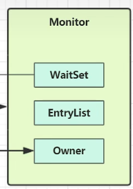
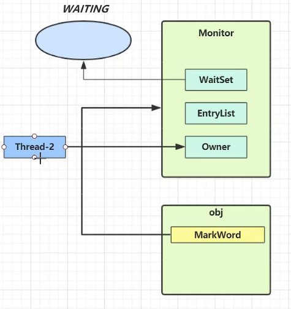
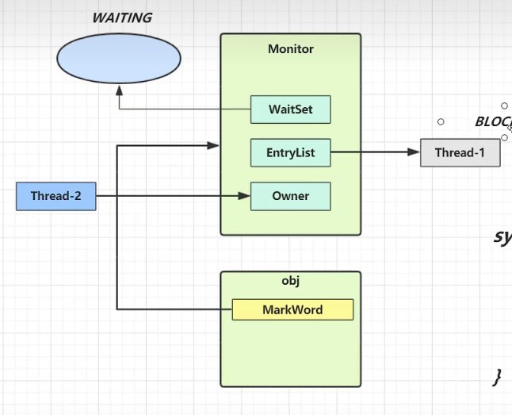
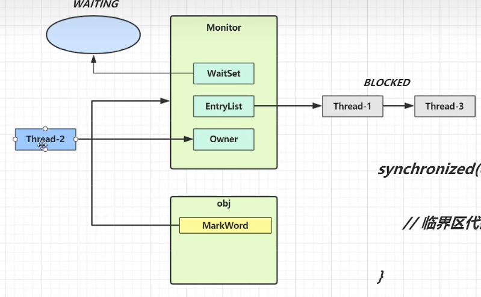
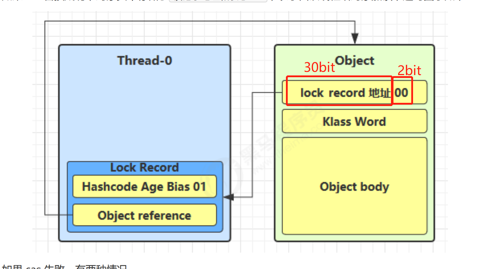
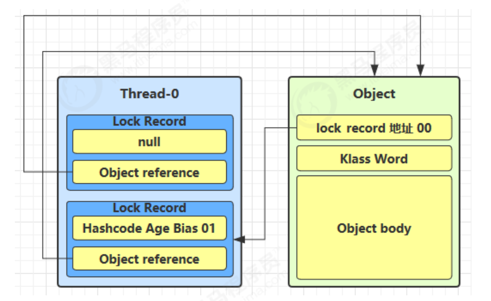

# monitor原理
重量级锁会使用monitor

monitor结构如下：



线程Thread2要对对象obj加锁的时候，obj的markword会指向monitor对象，thread2指向monitor的owner字段，从而实现对这个锁的占用



当另一个线程thread1想要获取obj的锁时候，会先检查对象的monitor的owener是否与其他线程关联

这里发现已经被线程thread2占用，会关联monitor的entryList，从而进入等待队列，将自己阻塞



再来的线程也会进入entryList



## 源码分析
Java代码
```java
static final Object lock = new Object();
static int counter = 0;
public static void main(String[] args) {
 synchronized (lock) {
 counter++;
 }
}
```
对应的字节码
```text
 Code:
 stack=2, locals=3, args_size=1
 0: getstatic #2 // <- lock引用 （synchronized开始）
 3: dup
 4: astore_1 // lock引用 -> slot 1
 5: monitorenter // 将 lock对象 MarkWord 置为 Monitor 指针
 6: getstatic #3 // <- i
 9: iconst_1 // 准备常数 1
 10: iadd // +1
 11: putstatic #3 // -> i
 14: aload_1 // <- lock引用
 15: monitorexit // 将 lock对象 MarkWord 重置, 唤醒 EntryList
 16: goto 24
 19: astore_2 // e -> slot 2 
 20: aload_1 // <- lock引用
 21: monitorexit // 将 lock对象 MarkWord 重置, 唤醒 EntryList
 22: aload_2 // <- slot 2 (e)
 23: athrow // throw e
 24: return
 Exception table:
 from to target type
 6 16 19 any
 19 22 19 any
```

# 锁的分类


## 偏向锁(也称为无锁状态)
HotSpot的作者经过研究发现，大多数情况下，锁不仅不存在多线程竞争，而且总是由同一线程多次获得，为了让线程获得锁的代价更低而引入了偏向锁
### 获取偏向锁
当一个线程访问同步块并获取锁时，会在对象头和栈帧中的锁记录里存储锁偏向的线程ID，以后该线程在进入和退出同步块时不需要进行CAS操作来加锁和解锁，只需简单地测试一下对象头的Mark Word里是否存储着指向当前线程的偏向锁。
如果测试成功，表示线程已经获得了锁。
如果测试失败，则需要再测试一下Mark Word中偏向锁的标识是否设置成1（表示当前是偏向锁）：如果没有设置，则使用CAS竞争锁；如果设置了，则尝试使用CAS将对象头的偏向锁指向当前线程
### 撤销偏向锁
当其他线程尝试竞争偏向锁时，持有偏向锁的线程才会释放锁。
当有线程2要进入代码块，尝试获取锁(假设现在线程1占用锁，锁为偏向锁)时
它会首先暂停拥有偏向锁的线程，然后检查持有偏向锁的线程1是否活着，如果线程1不处于活动状态或者已经退出需要锁的代码块，则将对象头设置成无锁状态
如果线程1还处于活动状态并且没有退出同步代码块，则将锁升级为轻量级锁
### 关闭偏向锁
偏向锁在Java 6和Java 7里是默认启用的，但是它在应用程序启动几秒钟之后才激活，如果有必要可以使用JVM参数来关闭延迟：`-XX:BiasedLockingStartupDelay=0`
如果你确定应用程序里所有的锁通常情况下处于竞争状态，可以通过JVM参数关闭偏向锁:`-XX:-UseBiasedLocking=false`,那么程序默认会进入轻量级锁状态
## 轻量级锁
### 使用场景
如果一个对象对然有多线程访问，但是多线程访问的时间是错开的（也就是没有竞争），可以使用轻量级锁
### 原理
假设针对如下代码：
```java
static final Object obj = new Object();
public static void method1() {
 synchronized( obj ) {
 // 同步块 A
 method2();
 }
}
public static void method2() {
 synchronized( obj ) {
 // 同步块 B
 }
}
```
假设此时thread0执行method1
#### 加锁过程
线程创建锁记录（Lock Record）对象，每个线程都的栈帧都会包含一个锁记录的结构，内部可以存储锁定对象的Mark Word


让锁记录中 Object reference 指向锁对象，并尝试用 cas 替换 Object 的 Mark Word，将 Mark Word 的值存入锁记录(此时锁记录为偏向锁/无锁状态)

如果CAS替换成功，对象头的MarkWord前30bit记录栈帧中Lock Record的地址，后2bit记录00，表示由该线程给对象加锁




如果Object中已经是00了，表示CAS失败，CAS失败有两种情况：
- 如果是其它线程已经持有了该 Object 的轻量级锁，这时表明有竞争，进入锁膨胀过程
- 如果是自己执行了 synchronized 锁重入，那么再添加一条 Lock Record 作为重入的计数


#### 解锁过程
当退出 synchronized 代码块（解锁时）如果有取值为 null 的锁记录，表示有重入，这时重置锁记录，表示重入计数减一

当退出 synchronized 代码块（解锁时）锁记录的值不为 null，这时使用 cas 将 Mark Word 的值恢复给对象头
- 成功，则解锁成功
- 失败，说明轻量级锁进行了锁膨胀或者已经升级为重量级锁

## 锁膨胀
