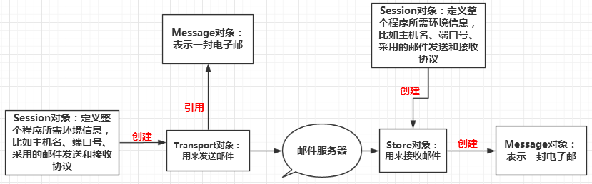

JavaMail API 按照功能可以划分为如下三大类：
- 创建和解析邮件的API
- 发送邮件的API
- 接收邮件的API
  
以上三种类型的API在JavaMail 中由多个类组成，但是主要有四个核心类，我们在编写程序时，记住这四个核心类，就很容易编写出Java邮件处理程序

- Message 类:javax.mail.Message 类是创建和解析邮件的核心 API，这是一个抽象类，通常使用它的子类javax.mail.internet.MimeMessage 类。它的实例对象表示一份电子邮件。客户端程序发送邮件时，首先使用创建邮件的 JavaMail API 创建出封装了邮件数据的 Message 对象，然后把这个对象传递给邮件发送API（Transport 类） 发送。客户端程序接收邮件时，邮件接收API把接收到的邮件数据封装在Message 类的实例中，客户端程序在使用邮件解析API从这个对象中解析收到的邮件数据
- Transport 类：javax.mail.Transport 类是发送邮件的核心API 类，它的实例对象代表实现了某个邮件发送协议的邮件发送对象，例如 SMTP 协议，客户端程序创建好 Message 对象后，只需要使用邮件发送API 得到 Transport 对象，然后把 Message 对象传递给 Transport 对象，并调用它的发送方法，就可以把邮件发送给指定的 SMTP 服务器
- Store 类：javax.mail.Store 类是接收邮件的核心 API 类，它的实例对象代表实现了某个邮件接收协议的邮件接收对象，例如 POP3 协议，客户端程序接收邮件时，只需要使用邮件接收 API 得到 Store 对象，然后调用 Store 对象的接收方法，就可以从指定的 POP3 服务器获得邮件数据，并把这些邮件数据封装到表示邮件的 Message 对象中
- Session 类：javax.mail.Session 类用于定义整个应用程序所需的环境信息，以及收集客户端与邮件服务器建立网络连接的会话信息，例如邮件服务器的主机名、端口号、采用的邮件发送和接收协议等。Session 对象根据这些信息构建用于邮件收发的 Transport 和 Store 对象，以及为客户端创建 Message 对象时提供信息支持

